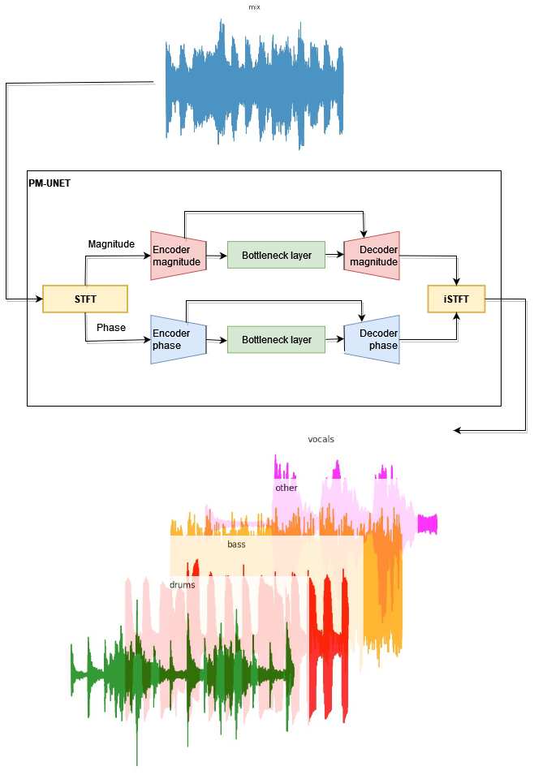

## Abstract

<table>

<tr>
<td>Music Source Separation</td>
<td>
    
</td>
</tr>

<tr>
<td>Model</td>
<td>
    
</td>
</tr>

</table>

## Examples

<table>

<tr><td></td><td>Adele - Rolling in the Deep</td></tr>

<tr>
<td>Original</td>
<td>
<audio controls preload src="https://drive.google.com/uc?export=open&id=1zJpyW1fYxHKXDcDH9s5DiBCYiRpraDB3">
</td>
</tr>

<tr>
<td>Vocals</td>
<td>
<audio controls preload src="https://drive.google.com/uc?export=open&id=1M1Yjr5qg2XQtrSpU0T2Ba5qsmyQ3pFGh">
</td>
</tr>

<tr>
<td>Drums</td>
<td>
<audio controls preload src="https://drive.google.com/uc?export=open&id=1jdFGzcjjXmcX1sFAkf-fniuECvSia0lF">
</td>
</tr>

<tr>
<td>Other</td>
<td>
<audio controls preload src="https://drive.google.com/uc?export=open&id=1D3yiUkxxKv_Zj5jZQqgGJsnYOIo7Xqgs">
</td>
</tr>

<tr>
<td>Bass</td>
<td>
<audio controls preload src="https://drive.google.com/uc?export=open&id=1kPOlYfYTPJu-Np3eua-zcwHQdkN8A3Ym">
</td>
</tr>

<tr><td></td><td>AC/DC - Highway to Hell</td></tr>

<tr>
<td>Original</td>
<td>
<audio controls preload src="https://drive.google.com/uc?export=open&id=1aWXYGeeJjfY3V6tzCLK5Jq1EcyNdpqbS">
</td>
</tr>

<tr>
<td>Vocals</td>
<td>
<audio controls preload src="https://drive.google.com/uc?export=open&id=14bA85Xh5Y8ndtUcH4PpHpLyn4GwSzLzW">
</td>
</tr>

<tr>
<td>Drums</td>
<td>
<audio controls preload src="https://drive.google.com/uc?export=open&id=1DTn9hkkr-nHfcbkWYr6NmgXjGSXwPh1P">
</td>
</tr>

<tr>
<td>Other</td>
<td>
<audio controls preload src="https://drive.google.com/uc?export=open&id=1qSyw6DFJLS-ePWtCIkmKl9Re7LbfPO7P">
</td>
</tr>

<tr>
<td>Bass</td>
<td>
<audio controls preload src="https://drive.google.com/uc?export=open&id=18EpDtYKW9bKhxXntKcT1pHOn6_69ntGT">
</td>
</tr>

<tr><td></td><td>The Greatest Showman - The Greatest Show</td></tr>

<tr>
<td>Original</td>
<td>
<audio controls preload src="https://drive.google.com/uc?export=open&id=1G5Aad12BrPycjAwfF-bRqwK-Gl2DTnvc">
</td>
</tr>

<tr>
<td>Vocals</td>
<td>
<audio controls preload src="https://drive.google.com/uc?export=open&id=1d06bvxY8a0K3mZ87sleYcN8bxJplscV7">
</td>
</tr>

<tr>
<td>Drums</td>
<td>
<audio controls preload src="https://drive.google.com/uc?export=open&id=1oRKpy-Cwb6X-UM0kFjMhWEbq4_Nj_G9Q">
</td>
</tr>

<tr>
<td>Other</td>
<td>
<audio controls preload src="https://drive.google.com/uc?export=open&id=1PsevxVjnKqtPdb7oWA9RtsOhilOfwPSI">
</td>
</tr>

<tr>
<td>Bass</td>
<td>
<audio controls preload src="https://drive.google.com/uc?export=open&id=10kIo2x_4c6vVsKTrS-4Qctu9gCJ70leG">
</td>
</tr>

<tr><td></td><td>Korol i Shut</td></tr>

<tr>
<td>Original</td>
<td>
<audio controls preload src="https://drive.google.com/uc?export=open&id=1cYnLrbnxr9JkVuUnkq9M1zetMY7XPAvy">
</td>
</tr>

<tr>
<td>Vocals</td>
<td>
<audio controls preload src="https://drive.google.com/uc?export=open&id=1tuZQxABe6N80pRRZhTmdX6TqS93V3A9J">
</td>
</tr>

<tr>
<td>Drums</td>
<td>
<audio controls preload src="https://drive.google.com/uc?export=open&id=1QdWE-bXhCEn6kdCYefgKU--jFGulJeqY">
</td>
</tr>

<tr>
<td>Other</td>
<td>
<audio controls preload src="https://drive.google.com/uc?export=open&id=1gS71d50n2ZoV6bnEwPa7Z2tnNuG4DOmJ">
</td>
</tr>

<tr>
<td>Bass</td>
<td>
<audio controls preload src="https://drive.google.com/uc?export=open&id=1lMNKfKuqxsplwy9oEIYSuy3qRzFOdrVL">
</td>
</tr>

</table>

## Relief

<table>

<tr>
<td>Space Pepe sad, because in space no music 🐸</td>
<td>
</td>
</tr>

</table>
